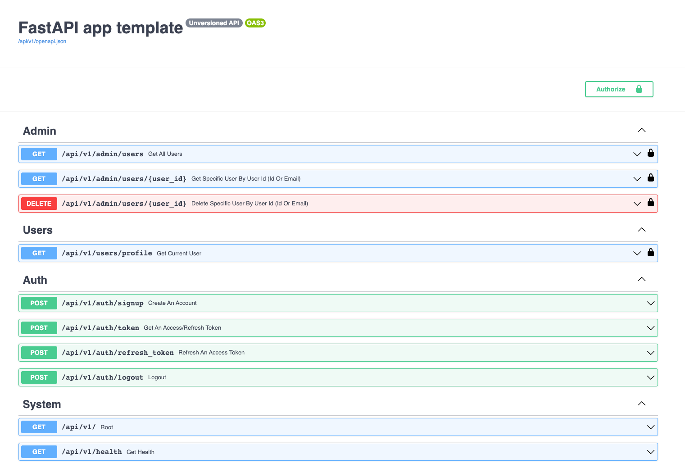

# [WIP] FastAPI app template

Simple FastAPI template to bootstrap a new project quickly.

## Installation

- [With Docker](docs/installation_with_docker.md)
- [Without Docker](docs/installation_without_docker.md)

**This project uses :**
- FastAPI
- SQLAlchemy
- (_Optional_) Redis to blacklist `access_token` and `refresh_token`