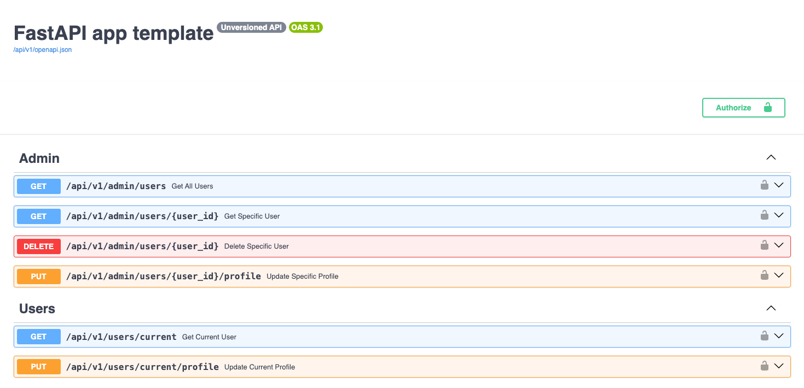

# FastAPI app template

Simple FastAPI template to bootstrap a new project quickly (Python > 3.10)

**This project uses :**
- [FastAPI](https://fastapi.tiangolo.com/) as web framework
- [Alembic](https://alembic.sqlalchemy.org/en/latest/) for database migrations
- [SQLAlchemy](https://www.sqlalchemy.org/) as ORM
- [Pydantic](https://docs.pydantic.dev/) for data validation
- [Docker](https://www.docker.com/) for containerization
- [Redis](https://redis.io/) to blacklist JWT tokens (_Optional_)

## Features

- [x] JWT authentication
- [x] Blacklist JWT tokens
- [x] Database migrations
- [x] Docker containerization
- [x] RBAC (Role-Based Access Control)
- [x] Role/Permission based on FastAPI Scopes (see [here](https://fastapi.tiangolo.com/advanced/security/oauth2-scopes/?h=scope))
- [x] Async FastAPI/SQLAlchemy
- [x] Sentry integration for error tracking (_Optional_)
- [x] Redis integration for JWT token blacklist (_Optional_ : use dict instead)
- [ ] Tests

## Installation

- [With Docker](docs/installation_with_docker.md)
- [Without Docker](docs/installation_without_docker.md)
